

<picture>
  <source media="(prefers-color-scheme: dark)" srcset="./assets/hero/hero-dark.svg">
  <source media="(prefers-color-scheme: light)" srcset="./assets/hero/hero-light.svg">
  
</picture>

 

<picture>
  <source media="(prefers-color-scheme: dark)" srcset="./assets/badges/badges-dark.svg">
  <source media="(prefers-color-scheme: light)" srcset="./assets/badges/badges-light.svg">
  
</picture>

 

**Systems across biomedical research, AI agent tooling, and market systems.**
Four open-source projects, plus the verification tooling that keeps them honest.

[Repositories](#systems) · [Data & methodology](#data--methodology) · [Stack](#stack) · [Contact](#contact)

 

## Systems

<table>
<tr>
<td width="50%" valign="top">

<a href="https://github.com/AdamEddahmouni/nosograph"><picture>
  <source media="(prefers-color-scheme: dark)" srcset="./assets/cards/nosograph-dark.svg">
  <source media="(prefers-color-scheme: light)" srcset="./assets/cards/nosograph-light.svg">
  
</picture></a>

 

**NosoGraph** — disease intelligence, connected.

Open-source research software for connecting disease knowledge, evidence, and provenance across biomedical sources.
Complements MONDO, HPO, PubMed, ClinicalTrials.gov, Open Targets and GWAS.

Evidence is typed by direction, and supporting, contradictory, inconclusive and unasserted records are allowed to coexist.
Missing metadata stays `unknown` rather than quietly becoming certainty.

Public Alpha · Apache-2.0 · not medical advice, not a diagnostic system, not clinical decision support.

[Repository](https://github.com/AdamEddahmouni/nosograph) · [Documentation](https://adameddahmouni.github.io/nosograph/) · [DOI](https://doi.org/10.5281/zenodo.22055279)

</td>
<td width="50%" valign="top">

<a href="https://github.com/AdamEddahmouni/agent-ready"><picture>
  <source media="(prefers-color-scheme: dark)" srcset="./assets/cards/agent-ready-dark.svg">
  <source media="(prefers-color-scheme: light)" srcset="./assets/cards/agent-ready-light.svg">
  
</picture></a>

 

**Agent-Ready** — the missing contract between repositories and coding agents.

A vendor-neutral specification and deterministic CLI for describing how AI coding agents should work inside a repository.
Like `package.json` for packages, `agent-ready.yaml` is the single schema-validated source of truth for commands, environment, instructions, restrictions, verification requirements and completion evidence.

No API keys. No LLM calls. No network access. Zero cost per run.

[Repository](https://github.com/AdamEddahmouni/agent-ready)

</td>
</tr>
<tr>
<td width="50%" valign="top">

<a href="https://github.com/AdamEddahmouni/market-trading-platform"><picture>
  <source media="(prefers-color-scheme: dark)" srcset="./assets/cards/market-trading-platform-dark.svg">
  <source media="(prefers-color-scheme: light)" srcset="./assets/cards/market-trading-platform-light.svg">
  
</picture></a>

 

**Market Trading Platform** — a monorepo workspace with a verification guard.

Integrated trading platform with governed snapshots, a source-to-snapshot manifest, and a lineage ledger recording every commit reachable from every captured child-repository ref.

`tools/monorepo_guard.py` refuses dirty parent trees, verifies child refs and visibility, rejects Gitlink snapshots, and confirms child repositories are unchanged.
`main` is protected and gated behind a required check.

[Repository](https://github.com/AdamEddahmouni/market-trading-platform) · [Monorepo workflow](https://github.com/AdamEddahmouni/market-trading-platform/blob/main/docs/MONOREPO_WORKFLOW.md)

</td>
<td width="50%" valign="top">

<a href="https://github.com/AdamEddahmouni/short-squeeze-screener-internship"><picture>
  <source media="(prefers-color-scheme: dark)" srcset="./assets/cards/short-squeeze-screener-internship-dark.svg">
  <source media="(prefers-color-scheme: light)" srcset="./assets/cards/short-squeeze-screener-internship-light.svg">
  
</picture></a>

 

**Short Squeeze Screener** — a read-only research screener.

Candidate analysis built around structured market data, quality checks and reproducibility, running entirely locally on `127.0.0.1`.

It does not place orders, access brokerage accounts, recommend trades, or claim predictive validation.
`FROZEN_DEMO` mode fixes the input set so a run is reproducible.

[Repository](https://github.com/AdamEddahmouni/short-squeeze-screener-internship) · [Getting started](https://github.com/AdamEddahmouni/short-squeeze-screener-internship/blob/main/short-squeeze-core/docs/getting-started.md)

</td>
</tr>
</table>

  <picture>
    <source media="(prefers-color-scheme: dark)" srcset="./assets/ui/divider-dark.svg">
    <source media="(prefers-color-scheme: light)" srcset="./assets/ui/divider-light.svg">
    
  </picture>

## What each one verifies

<table>
<tr>
<td width="25%" valign="top"><b>Declared scope</b> Where each project stops.</td>
<td width="25%" valign="top"><b>Evidence handling</b> What counts as support.</td>
<td width="25%" valign="top"><b>Reproducibility</b> Same input, same result.</td>
<td width="25%" valign="top"><b>Audit trail</b> Where the record lives.</td>
</tr>
<tr>
<td valign="top">NosoGraph is research software. Agent-Ready never calls a model. The screener never places a trade. The platform excludes credentials and unusable artifacts.</td>
<td valign="top">NosoGraph types evidence by direction and lets contradictions stand. The screener draws inconclusive readings as inconclusive rather than rounding them up.</td>
<td valign="top">Agent-Ready has no network dependency. The screener ships a frozen demo mode. NosoGraph regenerates its published counts from a script.</td>
<td valign="top">NosoGraph ships provenance and a Zenodo DOI. The platform keeps a JSONL commit ledger. Agent-Ready records completion evidence.</td>
</tr>
</table>

 

## Signal

<table>
<tr>
<td width="50%" valign="top">
<picture>
  <source media="(prefers-color-scheme: dark)" srcset="./assets/stats/stats-dark.svg">
  <source media="(prefers-color-scheme: light)" srcset="./assets/stats/stats-light.svg">
  
</picture>
</td>
<td width="50%" valign="top">
<picture>
  <source media="(prefers-color-scheme: dark)" srcset="./assets/stats/langs-dark.svg">
  <source media="(prefers-color-scheme: light)" srcset="./assets/stats/langs-light.svg">
  
</picture>
</td>
</tr>
</table>

 

<picture>
  <source media="(prefers-color-scheme: dark)" srcset="./assets/stats/activity-dark.svg">
  <source media="(prefers-color-scheme: light)" srcset="./assets/stats/activity-light.svg">
  
</picture>

## Stack

<picture>
  <source media="(prefers-color-scheme: dark)" srcset="./assets/chips/stack-dark.svg">
  <source media="(prefers-color-scheme: light)" srcset="./assets/chips/stack-light.svg">
  
</picture>

 

## Data & methodology

Everything on this page is generated from public data, and it is worth being precise about what each number is:

| Figure | Source | What it is not |
|---|---|---|
| Public commits, active days | Commit timestamps on the four project repositories, last 12 months | The GitHub contributions calendar, which counts private activity and is not accessible to a repo-scoped token |
| Repository composition | `GET /repos/:owner/:repo/languages` byte totals | A measure of proficiency — these repositories contain large vendored datasets, which is why Python dominates |
| Public repositories, followers | `GET /users/:owner` | Account activity, since accounts created in 2024 |
| Project figures | Read from each project's own status files and manifests | Estimates; where a figure is sampled, the sample size is stated in the project README |

The artwork on this page is generated by the pipeline in [`tools/`](./tools) from [`tools/design-tokens.json`](./tools/design-tokens.json), which is the single source of truth for the grid, type scale, radii, motion and palette.
Typefaces are OFL (Space Grotesk, JetBrains Mono), subset per asset and embedded, because an SVG served through an image tag cannot fetch a webfont.
Icons are [Simple Icons](https://simpleicons.org) (CC0).

No third-party image or badge service is called at render time, so nothing on this page can break because someone else's deployment paused.

## Contact

<a href="https://github.com/AdamEddahmouni"><picture>
  <source media="(prefers-color-scheme: dark)" srcset="./assets/ui/status-dark.svg">
  <source media="(prefers-color-scheme: light)" srcset="./assets/ui/status-light.svg">
  
</picture></a>

 

**Pennsylvania · Penn State · engineering, AI systems, open research**

<picture>
  <source media="(prefers-color-scheme: dark)" srcset="./assets/ui/footer-dark.svg">
  <source media="(prefers-color-scheme: light)" srcset="./assets/ui/footer-light.svg">
  
</picture>

[GitHub](https://github.com/AdamEddahmouni) ·
[Email](mailto:adameddahmouni@gmail.com) ·
[NosoGraph docs](https://adameddahmouni.github.io/nosograph/) ·
[Agent-Ready](https://github.com/AdamEddahmouni/agent-ready)

 

<b>Frequently asked</b>

 

**Is NosoGraph a diagnostic or clinical tool?**
No. It is research software for connecting evidence and provenance. It is a public alpha, it is not medical advice, and it is not clinical decision support.

**Does Agent-Ready send anything to a model?**
No. It has no API keys, makes no LLM calls, and needs no network access. It is a schema, a CLI, and a set of generated instruction files.

**Is the screener a trading system?**
No. It does not place orders, access brokerage accounts, recommend trades, or claim predictive validation. It runs read-only and locally.

**Are these projects affiliated with Penn State or any employer?**
No. They are personal open-source work.

**How is this README built?**
`node tools/render-all.mjs` regenerates every graphic from the design tokens and the live repository data, then asserts WCAG AA contrast. CI runs the same command plus an XML and geometry audit.

 

Repository text and code: MIT. Generated artwork: [CC0](https://creativecommons.org/publicdomain/zero/1.0/). Individual projects carry their own licences. Figures current as of the last automated run.

