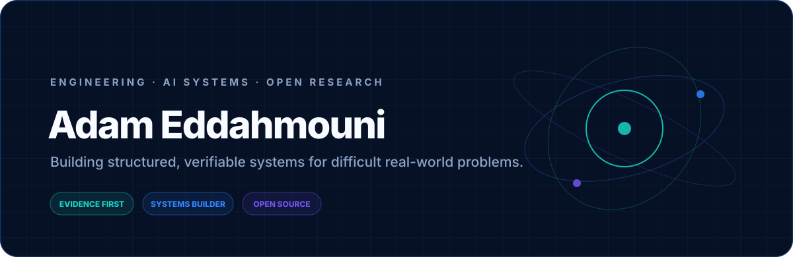
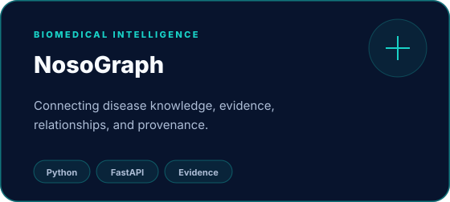
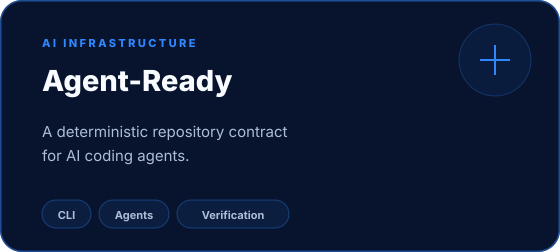
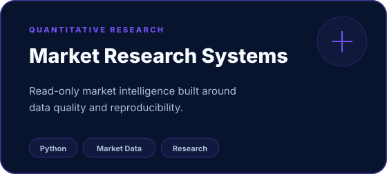

<div align="center">

<picture>
  <source media="(prefers-color-scheme: dark)" srcset="./assets/hero-dark.svg">
  <source media="(prefers-color-scheme: light)" srcset="./assets/hero-light.svg">
  
</picture>

<br>

**Engineering student building open-source systems across biomedical research, AI infrastructure, and market intelligence.**

I like difficult problems where **architecture, evidence, data quality, and usability all matter at once**.

[](https://github.com/AdamEddahmouni)


</div>

<br>

## Selected systems

<table>
<tr>
<td width="50%" valign="top">
<a href="https://github.com/AdamEddahmouni/nosograph"></a>

**Disease Intelligence. Connected.** Open-source research software for connecting disease knowledge, claims, evidence, and provenance across biomedical sources.

The design goal is not to manufacture certainty. It is to make the path from **claim → evidence → source → provenance** inspectable.

[Repository](https://github.com/AdamEddahmouni/nosograph) · [Docs](https://adameddahmouni.github.io/nosograph/)
</td>
<td width="50%" valign="top">
<a href="https://github.com/AdamEddahmouni/agent-ready"></a>

**Define once. Guide every agent. Verify the work.** A vendor-neutral specification and deterministic CLI for describing how AI coding agents should operate inside a repository.

Instead of scattering instructions across tools and prompts, the repository carries one structured contract.

[Repository](https://github.com/AdamEddahmouni/agent-ready)
</td>
</tr>
<tr>
<td width="50%" valign="top">
<a href="https://github.com/AdamEddahmouni/short-squeeze-screener-internship"></a>

A read-only short-squeeze research system built around **structured market data, quality checks, reproducibility, and explicit separation from trade execution**.

[Repository](https://github.com/AdamEddahmouni/short-squeeze-screener-internship)
</td>
<td width="50%" valign="top">

### What I keep coming back to

`computational medicine` · `AI agents` · `market intelligence` · `data provenance` · `deterministic systems` · `research tooling` · `engineering`

The common thread is turning messy information into something **structured enough to inspect, reason about, and verify**.

</td>
</tr>
</table>

## How I build

```text
frame the problem
      ↓
make assumptions explicit
      ↓
structure data + provenance
      ↓
build a deterministic core
      ↓
add AI where it genuinely helps
      ↓
verify with tests + evidence
      ↓
ship a usable system
```

> **Use AI to expand what a system can reason about without weakening what the system can prove.**

## Toolbox

<div align="center">


</div>

## GitHub signal

<div align="center">


</div>

<sub>Language cards describe public repository composition, not overall proficiency.</sub>

### Contributions in motion

<picture>
  <source media="(prefers-color-scheme: dark)" srcset="https://raw.githubusercontent.com/AdamEddahmouni/AdamEddahmouni/output/github-contribution-grid-snake-dark.svg">
  <source media="(prefers-color-scheme: light)" srcset="https://raw.githubusercontent.com/AdamEddahmouni/AdamEddahmouni/output/github-contribution-grid-snake.svg">
  
</picture>

## Principles

| | | |
|---|---|---|
| **Evidence over appearance**<br><sub>Make the reasoning inspectable.</sub> | **Determinism where possible**<br><sub>Repeatability is a feature.</sub> | **AI with boundaries**<br><sub>Use models where they add value.</sub> |
| **Preserve uncertainty**<br><sub>Unknown should stay unknown.</sub> | **Build the system**<br><sub>Not only the demo.</sub> | **Open work compounds**<br><sub>Infrastructure can become a platform.</sub> |

<br>

<div align="center">

### Build things that make difficult questions easier to investigate.

<sub>Adam Eddahmouni · engineering × software × research</sub>

</div>
