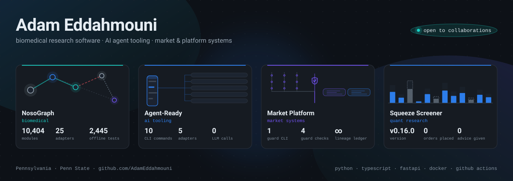
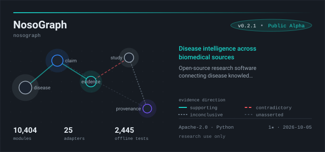
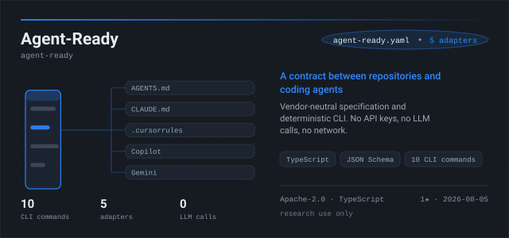
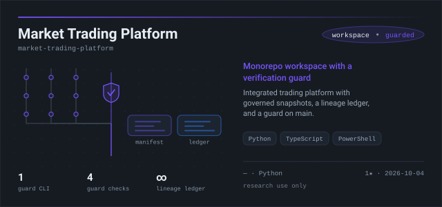
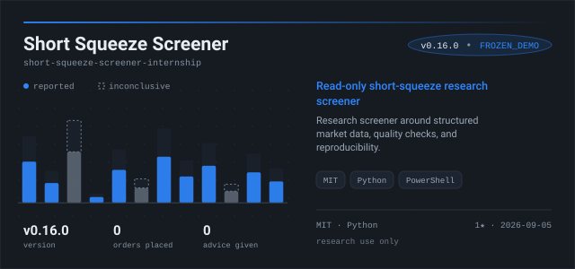
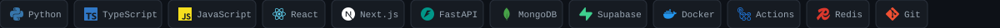

<picture>
  <source media="(prefers-color-scheme: dark)" srcset="./assets/hero/hero-dark.svg">
  <source media="(prefers-color-scheme: light)" srcset="./assets/hero/hero-light.svg">
  
</picture>

[Email](mailto:adameddahmouni@gmail.com) · [NosoGraph docs](https://adameddahmouni.github.io/nosograph/) · [Projects](#projects) · [Stack](#stack)

## Hi, I'm Adam 👋

I'm a Penn State student and full-stack developer building **AI tooling**, **biomedical research software**, and **quantitative market systems**, all in the open.

- 🧬 **Now building:** [NosoGraph](https://github.com/AdamEddahmouni/nosograph), an open-source graph that links disease knowledge to its evidence and sources.
- 🤖 **Also shipping:** [Agent-Ready](https://github.com/AdamEddahmouni/agent-ready), one config file that tells every AI coding agent how to work in your repo.
- 📈 **Interested in:** developer tooling, data pipelines, fintech, and applied ML.
- 🤝 **Open to:** internships, research collaborations, and open-source contributions.
- 📫 **Reach me:** [adameddahmouni@gmail.com](mailto:adameddahmouni@gmail.com)

## Projects

<table>
<tr>
<td width="50%" valign="top">

<picture>
  <source media="(prefers-color-scheme: dark)" srcset="./assets/cards/nosograph-dark.svg">
  <source media="(prefers-color-scheme: light)" srcset="./assets/cards/nosograph-light.svg">
  
</picture>

### [NosoGraph](https://github.com/AdamEddahmouni/nosograph)

Connects disease knowledge, evidence, and provenance across MONDO, HPO, PubMed, ClinicalTrials.gov, Open Targets and GWAS.
Every claim records whether evidence supports it, contradicts it, or is inconclusive, and missing data stays `unknown` rather than being guessed.

`Python` · 25 adapters · 2,445 offline tests · archived on Zenodo

[Code](https://github.com/AdamEddahmouni/nosograph) · [Docs](https://adameddahmouni.github.io/nosograph/) · [DOI](https://doi.org/10.5281/zenodo.22055279)

</td>
<td width="50%" valign="top">

<picture>
  <source media="(prefers-color-scheme: dark)" srcset="./assets/cards/agent-ready-dark.svg">
  <source media="(prefers-color-scheme: light)" srcset="./assets/cards/agent-ready-light.svg">
  
</picture>

### [Agent-Ready](https://github.com/AdamEddahmouni/agent-ready)

A `package.json` for AI coding agents.
Write one schema-validated `agent-ready.yaml` with your commands, rules and checks, and it generates `AGENTS.md`, `CLAUDE.md`, `.cursorrules`, Copilot and Gemini instructions from it.

`TypeScript` · JSON Schema · 10-command CLI · no API keys, fully offline

[Code](https://github.com/AdamEddahmouni/agent-ready)

</td>
</tr>
<tr>
<td width="50%" valign="top">

<picture>
  <source media="(prefers-color-scheme: dark)" srcset="./assets/cards/market-trading-platform-dark.svg">
  <source media="(prefers-color-scheme: light)" srcset="./assets/cards/market-trading-platform-light.svg">
  
</picture>

### [Market Trading Platform](https://github.com/AdamEddahmouni/market-trading-platform)

A monorepo that unifies my trading tools, with a guard script that keeps every snapshot traceable back to the exact commits it came from.
`main` is protected behind a required CI check.

`Python` · `TypeScript` · CI-gated `main` · commit lineage ledger

[Code](https://github.com/AdamEddahmouni/market-trading-platform) · [Workflow](https://github.com/AdamEddahmouni/market-trading-platform/blob/main/docs/MONOREPO_WORKFLOW.md)

</td>
<td width="50%" valign="top">

<picture>
  <source media="(prefers-color-scheme: dark)" srcset="./assets/cards/short-squeeze-screener-internship-dark.svg">
  <source media="(prefers-color-scheme: light)" srcset="./assets/cards/short-squeeze-screener-internship-light.svg">
  
</picture>

### [Short Squeeze Screener](https://github.com/AdamEddahmouni/short-squeeze-screener-internship)

A research screener that ranks short-squeeze candidates from structured market data, with data-quality checks at every step.
Runs fully locally and read-only, with a frozen demo mode for reproducible runs.

`Python` · v0.16 · local-only · reproducible demo mode

[Code](https://github.com/AdamEddahmouni/short-squeeze-screener-internship) · [Getting started](https://github.com/AdamEddahmouni/short-squeeze-screener-internship/blob/main/short-squeeze-core/docs/getting-started.md)

</td>
</tr>
</table>

## Stack

<picture>
  <source media="(prefers-color-scheme: dark)" srcset="./assets/chips/stack-dark.svg">
  <source media="(prefers-color-scheme: light)" srcset="./assets/chips/stack-light.svg">
  
</picture>

## Let's talk

I'm always happy to talk about research software, developer tooling, or markets.
Email me at **[adameddahmouni@gmail.com](mailto:adameddahmouni@gmail.com)**.

NosoGraph is research software, not medical advice. The screener places no trades and gives no investment advice.
