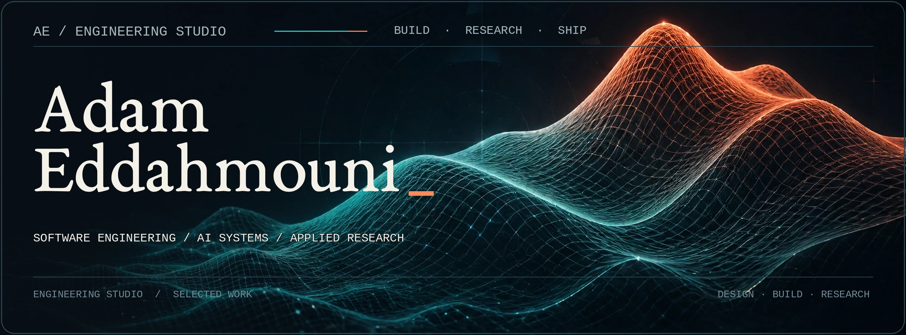
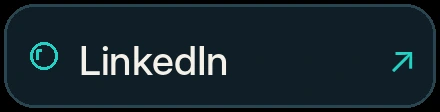
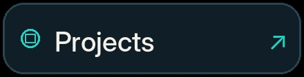
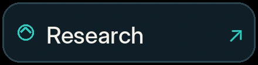
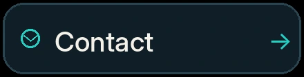
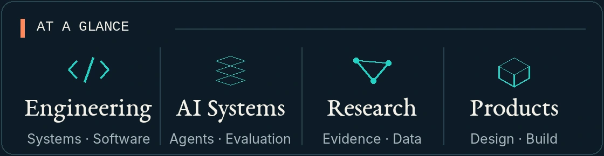
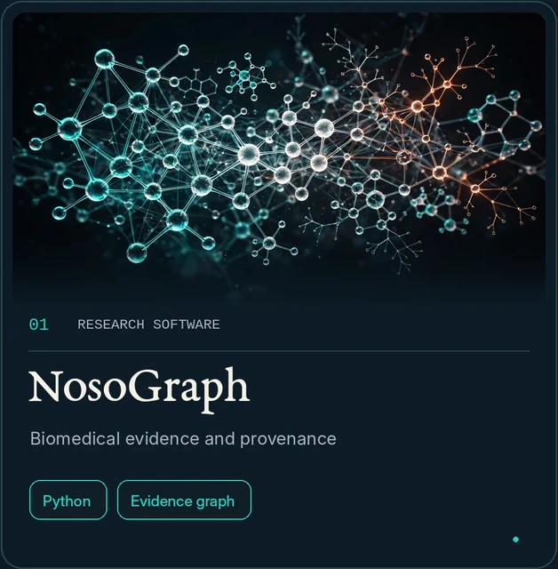
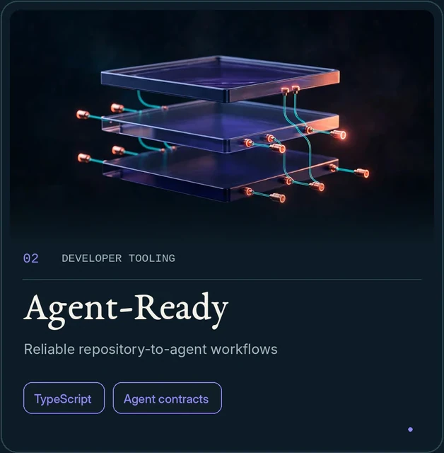
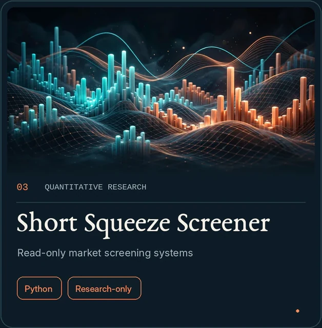
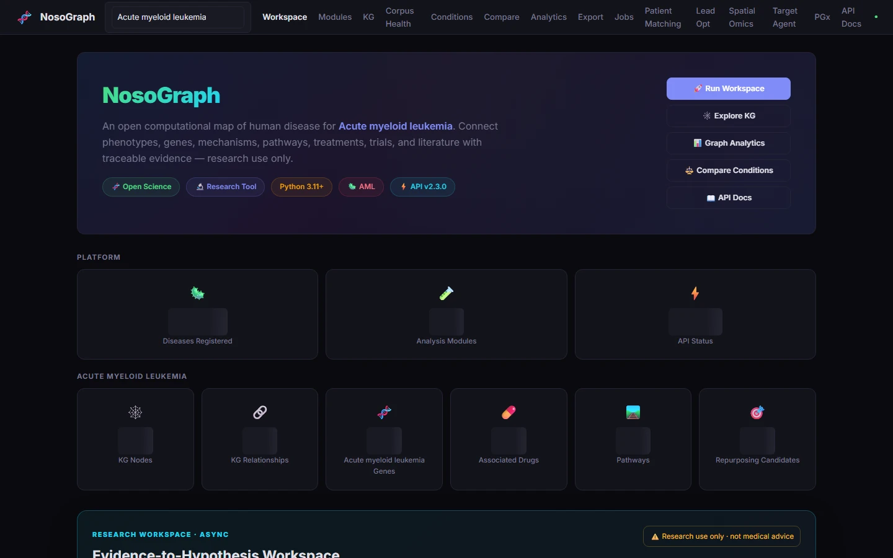

<picture>
  <source media="(max-width: 767px) and (prefers-color-scheme: dark)" srcset="./assets/studio-v4/presentation/hero/hero-mobile-dark.webp">
  <source media="(max-width: 767px) and (prefers-color-scheme: light)" srcset="./assets/studio-v4/presentation/hero/hero-mobile-light.webp">
  <source media="(prefers-color-scheme: dark)" srcset="./assets/studio-v4/presentation/hero/hero-desktop-dark.webp">
  <source media="(prefers-color-scheme: light)" srcset="./assets/studio-v4/presentation/hero/hero-desktop-light.webp">
  
</picture>

I build open-source research software, developer tooling, and market-data systems — systems that show their evidence instead of asserting it.

  <a href="https://www.linkedin.com/in/adameddahmouni/"><picture><source media="(prefers-color-scheme: light)" srcset="./assets/studio-v4/presentation/buttons/linkedin-light.webp"></picture></a>
  <a href="#selected-work"><picture><source media="(prefers-color-scheme: light)" srcset="./assets/studio-v4/presentation/buttons/projects-light.webp"></picture></a>
  <a href="https://adameddahmouni.github.io/nosograph/"><picture><source media="(prefers-color-scheme: light)" srcset="./assets/studio-v4/presentation/buttons/research-light.webp"></picture></a>
  <a href="mailto:adameddahmouni@gmail.com"><picture><source media="(prefers-color-scheme: light)" srcset="./assets/studio-v4/presentation/buttons/contact-light.webp"></picture></a>

## What I build

<picture>
  <source media="(max-width: 767px) and (prefers-color-scheme: dark)" srcset="./assets/studio-v4/presentation/glance/glance-mobile-dark.webp">
  <source media="(max-width: 767px) and (prefers-color-scheme: light)" srcset="./assets/studio-v4/presentation/glance/glance-mobile-light.webp">
  <source media="(prefers-color-scheme: dark)" srcset="./assets/studio-v4/presentation/glance/glance-desktop-dark.webp">
  <source media="(prefers-color-scheme: light)" srcset="./assets/studio-v4/presentation/glance/glance-desktop-light.webp">
  
</picture>

## Selected work

### NosoGraph

  <a href="https://github.com/AdamEddahmouni/nosograph">
    <picture>
      <source media="(max-width: 767px) and (prefers-color-scheme: dark)" srcset="./assets/studio-v4/presentation/gallery/nosograph-mobile-dark.webp">
      <source media="(max-width: 767px) and (prefers-color-scheme: light)" srcset="./assets/studio-v4/presentation/gallery/nosograph-mobile-light.webp">
      <source media="(prefers-color-scheme: light)" srcset="./assets/studio-v4/presentation/gallery/nosograph-desktop-light.webp">
      
    </picture>
  </a>

Biomedical knowledge connected to its underlying evidence, with source provenance, evidence direction, and explicit uncertainty. The public-alpha repository documents 25 pipeline adapters and a 2,445-test offline suite.

`Python` · `Research software` · `v0.2.1 public alpha`  
[Explore repository](https://github.com/AdamEddahmouni/nosograph) · [Documentation](https://adameddahmouni.github.io/nosograph/) · [Research DOI](https://doi.org/10.5281/zenodo.22055279)

### Agent-Ready

  <a href="https://github.com/AdamEddahmouni/agent-ready">
    <picture>
      <source media="(max-width: 767px) and (prefers-color-scheme: dark)" srcset="./assets/studio-v4/presentation/gallery/agent-ready-mobile-dark.webp">
      <source media="(max-width: 767px) and (prefers-color-scheme: light)" srcset="./assets/studio-v4/presentation/gallery/agent-ready-mobile-light.webp">
      <source media="(prefers-color-scheme: light)" srcset="./assets/studio-v4/presentation/gallery/agent-ready-desktop-light.webp">
      
    </picture>
  </a>

A deterministic repository contract for AI coding agents: one validated schema for allowed commands, protected paths, generated instructions, and verification evidence. The project documents 11 CLI commands and 557 tests.

`TypeScript` · `Developer tooling` · `5 agent adapters`  
[Explore repository](https://github.com/AdamEddahmouni/agent-ready)

### Short Squeeze Screener

  <a href="https://github.com/AdamEddahmouni/short-squeeze-screener-internship">
    <picture>
      <source media="(max-width: 767px) and (prefers-color-scheme: dark)" srcset="./assets/studio-v4/presentation/gallery/short-squeeze-screener-mobile-dark.webp">
      <source media="(max-width: 767px) and (prefers-color-scheme: light)" srcset="./assets/studio-v4/presentation/gallery/short-squeeze-screener-mobile-light.webp">
      <source media="(prefers-color-scheme: light)" srcset="./assets/studio-v4/presentation/gallery/short-squeeze-screener-desktop-light.webp">
      
    </picture>
  </a>

A read-only market-research screener for evaluating possible short-squeeze conditions using structured data and repeatable demo runs. It does not place orders or claim predictive accuracy.

`Python 3.12` · `Quantitative research` · `FROZEN_DEMO`  
[Explore repository](https://github.com/AdamEddahmouni/short-squeeze-screener-internship) · [Getting started](https://github.com/AdamEddahmouni/short-squeeze-screener-internship/blob/main/short-squeeze-core/docs/getting-started.md)

## Engineering evidence

NosoGraph's research pipeline preserves the chain from source records to validated claims, evidence direction, and source snapshots. Supporting, contradictory, inconclusive, and unasserted evidence remain distinct rather than collapsing into a single verdict.

<picture>
  <source media="(max-width: 767px) and (prefers-color-scheme: dark)" srcset="./assets/evidence/pipeline-mobile-dark.svg">
  <source media="(max-width: 767px) and (prefers-color-scheme: light)" srcset="./assets/evidence/pipeline-mobile-light.svg">
  <source media="(prefers-color-scheme: dark)" srcset="./assets/evidence/pipeline-desktop-dark.svg">
  <source media="(prefers-color-scheme: light)" srcset="./assets/evidence/pipeline-desktop-light.svg">
  
</picture>

<strong>Real capture: the public Evidence Explorer</strong>

 

  

Interface capture published in the public NosoGraph repository. Research software, not clinical guidance, and not a hosted demo.

The work is inspectable in the repositories: [NosoGraph's evidence model](https://github.com/AdamEddahmouni/nosograph/blob/master/docs/architecture/evidence-model.md), [Agent-Ready's CLI reference](https://github.com/AdamEddahmouni/agent-ready/blob/main/docs/specification/cli-reference.md) and [recorded adapter outputs](https://github.com/AdamEddahmouni/agent-ready/tree/main/compatibility/adapter-output/v2), and the [screener's CLI documentation](https://github.com/AdamEddahmouni/short-squeeze-screener-internship/blob/main/short-squeeze-core/docs/CLI.md).

## Capabilities

**Engineering** — Python · TypeScript · JavaScript · Node.js · FastAPI · Docker · GitHub Actions  
**AI and agent systems** — agent contracts · schema validation · deterministic tooling · evaluation workflows  
**Research and data** — biomedical evidence modelling · ontology integration · provenance · quantitative screening  
**Products and delivery** — full-stack software · developer experience · interfaces · test automation

## GitHub activity

<picture>
  <source media="(max-width: 767px) and (prefers-color-scheme: dark)" srcset="./assets/activity/activity-mobile-dark.svg">
  <source media="(max-width: 767px) and (prefers-color-scheme: light)" srcset="./assets/activity/activity-mobile-light.svg">
  <source media="(prefers-color-scheme: dark)" srcset="./assets/activity/activity-desktop-dark.svg">
  <source media="(prefers-color-scheme: light)" srcset="./assets/activity/activity-desktop-light.svg">
  
</picture>

## Contact

I'm a Penn State student, open to internships, research collaborations, and conversations about engineering software, agent tooling, or market-data systems.

**[Email](mailto:adameddahmouni@gmail.com)** · **[LinkedIn](https://www.linkedin.com/in/adameddahmouni/)** · **[GitHub](https://github.com/AdamEddahmouni)** · **[Research documentation](https://adameddahmouni.github.io/nosograph/)**

Featured artwork is conceptual illustration, not product screenshots or actual market/medical data; the NosoGraph capture is the exception and is labelled as a real interface. NosoGraph is research software, not medical advice. The screener does not provide investment advice or execute trades. Historical numerical figures are attributed to the respective project repositories.
